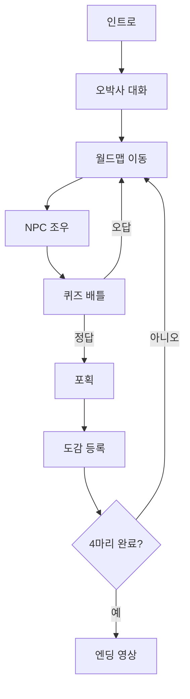
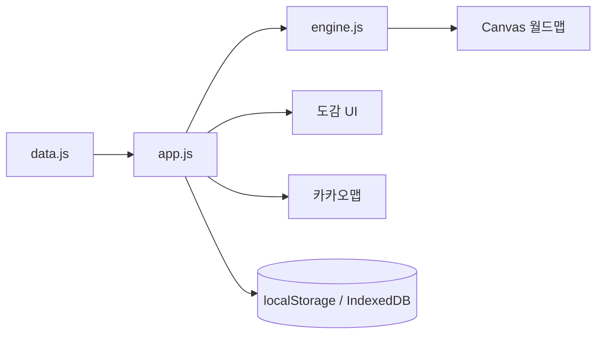

# 2조 개발자 도감

## 소개

- 포켓몬 골드 스타일의 정적 웹 게임
- 개발자몬 4마리를 만나 퀴즈를 풀고 도감에 등록
- 도감에서 팀원 정보, GitHub Pages, 좋아하는 식당 지도 확인
- 4마리 모두 포획하면 엔딩 영상 재생

## 핵심 기능

| 기능 | 내용 |
| --- | --- |
| 인트로 | 오박사 안내와 2조 소개 |
| 월드맵 | 캔버스 기반 맵 이동, NPC 조우 |
| 배틀 | 개발자별 퀴즈, 정답 시 포획 |
| 도감 | 프로필, 퀴즈 답, GitHub Pages 링크 |
| 지도 | 카카오맵 SDK로 식당 위치 표시 |
| 현재 위치 | Geolocation API로 사용자 위치 마커 표시 |
| 엔딩 | 4마리 포획 완료 시 `assets/story/ending.mp4` 재생 |
| 반응형 | 모바일 인트로, 배틀, 도감, 컨트롤러 대응 |

## 기술 스택

| 영역 | 사용 |
| --- | --- |
| Frontend | HTML, CSS, Vanilla JavaScript |
| Rendering | Canvas 2D |
| Map | Kakao Maps JavaScript SDK |
| Location | Geolocation API |
| Storage | localStorage, IndexedDB |
| Deploy | GitHub Pages |

## 실행

```powershell
node local-server.mjs 8010
```

```text
http://127.0.0.1:8010/index.html
```

| 환경 | 비고 |
| --- | --- |
| `file://` | 기본 화면 확인용 |
| `localhost` / `127.0.0.1` | 로컬 개발 권장 |
| GitHub Pages | 카카오맵, 위치 권한 배포용 |

## 구조

```text
pixel-game
├─ index.html
├─ styles.css
├─ data.js
├─ app.js
├─ engine.js
├─ dragdrop.js
├─ audio.js
├─ local-server.mjs
├─ assets
│  ├─ battle
│  ├─ map
│  ├─ profile
│  └─ story
├─ src
└─ tests
```

## 파일 역할

| 파일 | 역할 |
| --- | --- |
| `index.html` | 화면 마크업, 스크립트 로드 |
| `styles.css` | 전체 UI와 모바일 반응형 |
| `data.js` | 팀원, 퀴즈, 식당, 카카오 API 키 |
| `app.js` | 게임 상태, 배틀, 도감, 지도, 엔딩 |
| `engine.js` | 월드맵 렌더링, 이동, 충돌 |
| `dragdrop.js` | 장비 드래그 앤 드롭 |
| `audio.js` | 효과음, 배경음 |
| `assets/` | 이미지, 스프라이트, 엔딩 영상 |
| `tests/` | 입력/설정 테스트 |

## 동작 흐름



## 데이터 흐름



## 상태 구조

| 상태 | 화면 |
| --- | --- |
| `INTRO` | 시작 화면 |
| `DIALOGUE` | 오박사 대화 |
| `WORLD` | 월드맵 |
| `BATTLE` | 퀴즈 배틀 |
| `ENDING` | 엔딩 영상 |

## 지도 정보

| 팀원 | 식당 | 카테고리 |
| --- | --- | --- |
| 김영만 | 뚱가의정부부대찌개 가락점 | 부대찌개 |
| 김준하 | 함경도찹쌀순대 | 순댓국 |
| 이유경 | K밥상 | 한식 |
| 이주영 | 샤브로21 가락시장 | 샤브샤브 |

## 테스트

```powershell
node --check app.js data.js src/features/audio/audio.js
node tests\world-input.test.mjs
node tests\pokeball-config.test.mjs
```

## 정리 내역

- 미사용 배틀/프로필 이미지 삭제
- 예전 로컬 BGM/영상 파일 삭제
- 중복 로컬 서버 파일 삭제
- 사용하지 않는 추가 타일 샘플 삭제
- 실제 사용 에셋은 유지
